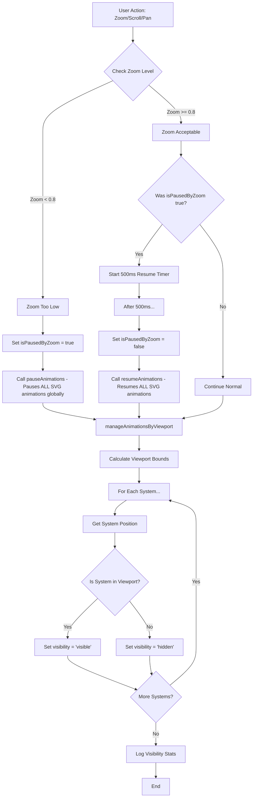

# Animation & Visibility Management Flow Chart

## System Overview
The game has two independent but related systems:
1. **Zoom-based animation control** - Pauses ALL animations when zoomed out to save battery
2. **Viewport-based visibility culling** - Hides individual systems outside viewport to save rendering

## Logic Flow



## Key Components

### 1. Zoom-Based Animation Control (`manageAnimationsByZoom`)
- **Trigger**: Any zoom change via `applyMapZoomTransform()`
- **Threshold**: 0.8x zoom (when scale < 0.8, animations pause)
- **Behavior**: 
  - Uses global SVG pause/resume (affects entire SVG timeline)
  - Has 500ms debounce on resume to prevent flickering
  - Sets `isPausedByZoom` flag

### 2. Viewport-Based Visibility Culling (`manageAnimationsByViewport`)
- **Trigger**: 
  - Initial load (after 2x requestAnimationFrame)
  - Scroll events (throttled to 100ms)
  - Zoom changes
- **Behavior**:
  - Calculates viewport bounds with 100px padding
  - For each system, checks if position is within bounds
  - Sets CSS `visibility: hidden/visible` per system
  - Hidden systems don't render (saves GPU) but animations continue in background

### 3. System Position Detection
- **Primary**: Check for `transform="translate(x,y)"` attribute
- **Fallback**: Get `cx` and `cy` from first `<circle>` element
- **Used by**: Viewport culling to determine if system is visible

## Problem That Was Fixed

### Before Fix:
```
if (gameState.animation.isPausedByZoom) return; // EXIT EARLY - BUG!
```
- When zoomed out, viewport culling would exit early
- Systems would get hidden but never unhidden
- Only Sol and nearby systems would remain visible

### After Fix:
```
// Always run visibility management regardless of zoom state
// No early return based on isPausedByZoom
```
- Visibility management always runs
- Systems properly show/hide based on viewport
- Zoom-based animation pause doesn't interfere with visibility

## Current State

1. **Zoom >= 0.8x**: 
   - Animations run for visible systems
   - Hidden systems have `visibility: hidden` but animations continue
   
2. **Zoom < 0.8x**:
   - ALL animations globally paused (battery saving)
   - Visibility still managed per viewport (systems show/hide correctly)
   
3. **Performance Benefits**:
   - Hidden systems don't paint (major GPU/CPU savings)
   - Zoomed out view pauses all animations (battery savings)
   - Only visible, animated systems consume resources

## Files & Functions

- **File**: `game.js`
- **Key Functions**:
  - `applyMapZoomTransform()` (line ~4125) - Applies zoom and triggers management
  - `manageAnimationsByZoom()` (line ~4144) - Handles zoom-based pause/resume
  - `manageAnimationsByViewport()` (line ~4187) - Handles viewport visibility
  - `setupViewportAnimationCulling()` (line ~4279) - Sets up scroll listeners
  - `setupPinchZoomHandlers()` (line ~4298) - Touch/trackpad zoom handling